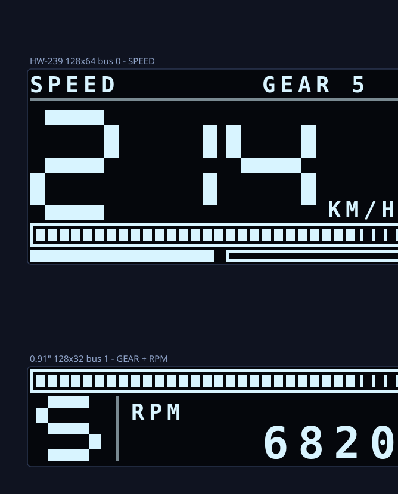

# Race dash — Forza Horizon 5 telemetry on two OLEDs

A physical dashboard for the DIY force-feedback wheel. Forza Horizon 5 streams
telemetry over UDP, a small Python program on the PC picks out three numbers,
and an ESP32 draws them on two OLED panels.

```
FH5  --Data Out UDP-->  forza_bridge.py  --USB serial-->  NodeMCU  --I2C-->  2 OLEDs
```

> **Just want to build it?** Follow **[STEPS.md](STEPS.md)** — nine numbered
> steps for the NodeMCU, no theory. This README is the reference behind it.

**It does not touch the steering wheel.** The Leonardo keeps running EMC Lite
and keeps being a HID game controller. Nothing here writes to it, resets it, or
opens its port — see [Living with EMC Utility](#living-with-emc-utility).

| Panel | NodeMCU pins | Shows |
| --- | --- | --- |
| HW-239, 128x64 | `D2`/`D1` | speed in mph, huge seven-segment digits, rev bar, throttle + brake bars |
| 0.91", 128x32 | `D6`/`D5` | gear, RPM, segmented shift bar with a flashing redline |



Both panels at 214 km/h (the preview predates the switch to mph), gear 5, 6820 RPM. The digits are hand-drawn seven-segment
shapes rather than the stock font, so they read at a glance from wheel distance.
The four tick marks at the right end of the rev bar are the redline; the whole bar
strobes at 8 Hz once you cross it.

## Hardware

| Item | Which one | Why |
| --- | --- | --- |
| **NodeMCU ESP8266** | the board marked `ESP8266MOD` | what you have; software I²C can be re-pointed between two pin pairs |
| HW-239 OLED 128x64 | you have this | speed |
| 0.91" OLED 128x32 | you have this | gear + RPM |
| 4 jumper wires per panel | female-to-female | — |
| Micro-USB cable | **data**, not charge-only | half of all "board not detected" reports are a charge-only cable |

### Board options

| Board | Verdict |
| --- | --- |
| **NodeMCU ESP8266** | **Use this.** One software I²C bus, re-pointed between pin pairs before each panel is drawn. Costs a little speed (~22 fps vs 30) and nothing else. |
| **ESP32 WROOM-32** | Also supported (`racedash`). Two hardware I²C controllers, one panel each. Slightly faster; buy one only if you want to. |
| **Arduino Leonardo** | Already busy being your wheel. Uploading anything erases EMC Lite. Also enumerates as HID, so a second one risks Forza picking the wrong controller. |
| **Arduino Uno / Nano** | One *hardware* I²C bus that cannot be re-pointed, so both 0x3C panels collide — you would have to unsolder an address resistor or buy a multiplexer. And the two frame buffers are 1536 bytes of the ATmega's 2048. |
| **ESP32-C3** | One I²C controller *and* real hardware I²C. Neither trick available. |

One point matters more than it sounds: the dashboard board must **not** be an
HID device, or Forza may bind to it instead of the wheel. A CH340/CP2102
NodeMCU is invisible to the game.

## Wiring

Full tables, the HW-239 identification, and a diagram are in
[WIRING.md](WIRING.md). The short version:

| Panel | VCC | GND | SDA | SCL |
| --- | --- | --- | --- | --- |
| HW-239 128x64 | `3V3` | `G` | `D2` (GPIO4) | `D1` (GPIO5) |
| 0.91" 128x32 | `3V3` | `G` | `D6` (GPIO12) | `D5` (GPIO14) |

**3V3, never `VIN`.** The panels' pull-up resistors tie the bus to VCC, and the
ESP8266's pins are not 5V tolerant.

**Keep off `D3`, `D4` and `D8`** — they are boot strapping pins, and an OLED's
pull-up resistors alone are enough to stop the board starting.

## Software you need to install

### On the PC

```bash
pip install pyserial
```

That is the only Python dependency. Python 3.8 or newer.

### Arduino libraries

Install through **Sketch → Include Library → Manage Libraries**:

| Library | Author | Note |
| --- | --- | --- |
| **Adafruit SSD1306** | Adafruit | the panel driver |
| **Adafruit GFX Library** | Adafruit | shapes and text |
| **Adafruit BusIO** | Adafruit | pulled in automatically; accept the prompt |

`Wire.h` ships with the board package — nothing to install.

> All three are already present in your `Documents\Arduino\libraries`, along
> with ESP32 core 3.3.11. Nothing to install on this machine.

### Board support

**Tools → Board → Boards Manager**, search `esp8266`, install **esp8266 by ESP8266
Community**. Then **Tools → Board → ESP8266 Boards → NodeMCU 1.0 (ESP-12E Module)**.

Already installed here — esp8266 core 3.1.2, and esp32 core 3.3.11 if you ever
switch boards.

## Build it in this order

Do not skip ahead. Each step proves one thing, so when something breaks you
know which thing.

### Step 1 — prove the board and both buses

Flash the scanner:

```bash
powershell -File flash.ps1 -Sketch i2c_scan8266 -Port COM7
```

Open the serial monitor at **115200**. Expected:

```
panel A on D2/D1 (GPIO4/5)  : 0x3C
panel B on D6/D5 (GPIO12/14): 0x3C
```

| Output | Meaning |
| --- | --- |
| both buses show `0x3C` | perfect, carry on |
| one says `nothing found` | that panel's wiring is wrong — check VCC/GND first, then SDA/SCL |
| an address of `0x3D` | fine, but change `OLED_ADDR` in `racedash.ino` |
| dozens of addresses | SDA and SCL are swapped on that bus |

**Do not continue until both buses answer.** Everything after this assumes they do.

### Step 2 — prove the panels draw

```bash
powershell -File flash.ps1 -Sketch racedash8266 -Port COM7
```

On boot it runs a self-test: 179 MPH, gear 6, 7400 RPM, full throttle, bars
lit. Both panels for 2.5 seconds. Then they fall to `WAITING` / `NO DATA`,
because no PC program is running yet. **That is correct.**

If the upload says *Failed to connect*, hold the **FLASH** button while it
prints `Connecting....`

If the picture is shifted sideways by a couple of pixels or is pure noise, your
panel is an SH1106 rather than an SSD1306 — say so, it is a small change.

### Step 3 — prove the serial link, with the game closed

```bash
python forza_bridge.py --demo
```

This invents a drive: six gears, speed sweeping to 285, revs climbing into the
redline each time. Both panels should animate, and the shift bar should strobe
near the top of each gear.

If this works, **the entire hardware half of the project is finished.** Anything
that fails after this point is game or network configuration.

### Step 4 — prove Forza is sending, with no hardware involved

Leave the ESP32 out of it:

```bash
python forza_bridge.py --no-serial
```

Now turn Data Out on in the game (next section) and drive. You should see a
line per second:

```
147 mph    5210 rpm /  7800  gear 4   thr 255  brk   0  racing
```

If it says `waiting for packets ... (0 received)`, the packets are not arriving
— go to [Troubleshooting](#troubleshooting).

### Step 5 — everything at once

```bash
python forza_bridge.py
```

Drive.

## Enabling Data Out in Forza Horizon 5

In the game:

**Settings → HUD and Gameplay →** scroll to the **very bottom** of the list.

| Setting | Value |
| --- | --- |
| `DATA OUT` | **ON** |
| `DATA OUT IP ADDRESS` | `127.0.0.1` |
| `DATA OUT IP PORT` | `5300` |

Back out of the menu so the setting saves. The port is arbitrary — any free
number between 1024 and 65535 — but it must match `--udp-port`, which defaults
to 5300.

Two things people expect to find and will not:

- **There is no packet-format option in FH5.** Forza *Motorsport* offers
  "Sled" vs "Car Dash"; Horizon does not, and always sends its own format.
- **There is no on-screen confirmation.** The game gives no indication that
  anything is listening. Step 4 above is how you check.

### If you own the Microsoft Store / Game Pass version

Store builds run in an AppContainer, and Windows blocks those from talking to
`127.0.0.1`. The game sends, Windows silently drops it, and you see zero
packets.

Two fixes, easiest first:

**A. Send to your own LAN address instead of loopback.** Not loopback, so the
restriction does not apply. Find it with:

```bash
ipconfig
```

Take the `IPv4 Address` of your active adapter (something like `192.168.1.42`)
and put *that* in `DATA OUT IP ADDRESS` instead of `127.0.0.1`. Nothing else
changes — the bridge already binds every interface.

**B. Grant the loopback exemption.** In an **Administrator** PowerShell:

```bash
CheckNetIsolation LoopbackExempt -a -n=Microsoft.SunriseBaseGame_8wekyb3d8bbwe
```

Check it took:

```bash
CheckNetIsolation LoopbackExempt -s
```

The Steam version needs neither of these.

## How the telemetry is decoded

Forza packets begin with a fixed 232-byte block, with the dashboard fields in a
second block appended to it. **Where that second block starts depends on the
game, and the only way to tell the games apart is the packet length:**

| Bytes | Game | Dash block starts at |
| --- | --- | --- |
| 232 | Forza Motorsport 7, "sled" | *no dash data at all* |
| 311 | Forza Motorsport 7, "car dash" | 232 |
| 323 | Forza Horizon 4 | 244 |
| **324** | **Forza Horizon 5** | **244** |
| 331 | Forza Motorsport (2023) | 232 |

Horizon inserts 12 undocumented bytes after the sled block. Reading FH5 with
Forza Motorsport offsets lands every field 12 bytes early — that is the classic
"my speed is nonsense" bug, and it is what most old tutorials get wrong.

The three fields this project wants, for FH5:

| Field | Offset | Type | Note |
| --- | --- | --- | --- |
| `IsRaceOn` | 0 | int32 | 0 while in a menu |
| `EngineMaxRpm` | 8 | float32 | needed to scale the rev bar |
| `CurrentEngineRpm` | 16 | float32 | |
| `Speed` | **256** | float32 | **metres per second** — multiply by 3.6 |
| `Accel` | 315 | uint8 | throttle, 0–255 |
| `Brake` | 316 | uint8 | |
| `Gear` | **319** | uint8 | 0 = reverse, 1..n = forward |

`Speed` is in m/s no matter which units the game's own HUD is set to.

The offsets are cross-checked rather than copied: the dash block is 79 bytes,
so 244+79 = 323 (FH4), 232+79 = 311 (FM7 car dash), FH5 is FH4 plus one trailing
byte = 324, and FM 2023 is FM7 car dash plus four tyre-wear floats and a track
ordinal = 331. All four published packet sizes fall out of the same layout.

Sources: the field order matches the community structure listing at
[raweceek-temeletry/forza-horizon-5-UDP](https://github.com/raweceek-temeletry/forza-horizon-5-UDP)
and the format strings in
[theRTB/ForzaShiftTone](https://github.com/theRTB/ForzaShiftTone), which
documents the 12-byte Horizon placeholder and the FH4-vs-FH5 trailing byte.
[richstokes/Forza-data-tools](https://github.com/richstokes/Forza-data-tools)
independently confirms the 323/324 sizes and that speed is m/s.

## The serial protocol

115200 baud, newline terminated. Same `OK` / `ERR` / `#` convention as the
parking sensor, so the same log readers work.

The PC sends telemetry frames at 30 Hz:

```
D <speed> <rpm> <maxrpm> <gear> <thr> <brk> <race> <mph>
```

e.g. `D 133 6820 7800 5 255 0 1 1`

`<speed>` is already in the display unit — the PC does the conversion, because
Forza sends metres per second regardless. `<mph>` is `1` for mph, `0` for km/h,
and only decides which label the boards print.

That flag is deliberately **last**. Firmware reads the first seven fields with
`strtok` and stops, so a board flashed before this field existed keeps working
against a newer bridge instead of rejecting the line.

Switch units with `--units kmh`; the default is mph. No reflash needed.

The game sends 60 packets a second; two OLEDs cannot draw that fast, so the
bridge keeps only the newest packet in the buffer and sends 30. Without that
drain the socket backs up and the dash runs seconds behind.

| Command | Effect |
| --- | --- |
| `PING` | `OK PONG racedash 1.0` |
| `GET` | dump current state |
| `DEMO ON\|OFF` | fake sweep with no PC data |
| `BRIGHT <0-255>` | panel contrast |
| `TEST` | redraw the boot self-test |

The board emits `# alive frames=N stale=0` every 3 seconds so a silent link is
distinguishable from a dead board.

## Living with EMC Utility

The wheel and the dashboard share nothing except the PC. Still, four rules:

1. **Never upload a sketch to the Leonardo.** It runs `EMCLite0932.hex`, not an
   Arduino sketch. An upload erases the firmware and the wheel stops working
   until you re-flash with XLoader. This is already written up in
   [../steering-wheel/WIRING.md](../steering-wheel/WIRING.md).
2. **Always pass `-Port` to `flash.ps1`, or let it list ports for you.** The
   script refuses any port whose USB VID is `2341`, `2A03`, `1B4F` or `0013` —
   Arduino-family and EMC Dev. It will not flash your wheel even if you ask it to.
3. **`forza_bridge.py` has the same blocklist.** Auto-detect only ever accepts a
   known USB-serial bridge (CP2102, CH340, CH9102, FTDI). Naming a blocked port
   explicitly is refused with an explanation. This matters because opening a
   serial port toggles DTR, which resets the board on the other end — mid-race.
4. **Data Out is read-only.** It is a UDP broadcast out of the game. It cannot
   affect force feedback, input, or EMC Utility. Leave EMC Utility running.

You can have EMC Utility open, the wheel connected, and the bridge running at
the same time. They do not interact.

## Troubleshooting

### Nothing on either panel

- Run `i2c_scan`. If it finds nothing, it is wiring, not code.
- Check the panel is on `3V3` and `GND` the right way round. Read the
  silkscreen — pin order varies between modules.
- Try the panel on bus 0 alone. A single dead panel does not stop the other;
  `racedash` reports which bus failed on the serial monitor.

### One panel works, the other does not

- Swap the two panels between buses. If the fault follows the panel, it is the
  panel. If it stays on the bus, it is the wiring or the pins.
- Confirm you did not put both panels on the same bus. Two devices at 0x3C on
  one bus is exactly the collision this design avoids.

### Picture shifted a few pixels sideways, or garbled

Your module is an **SH1106**, not an SSD1306. Common on 1.3" boards. Needs a
different library — a small change, just ask.

### `i2c_scan` lists dozens of addresses

SDA and SCL are swapped on that bus.

### Board not detected / no COM port

- Charge-only USB cable. Very common.
- Missing driver: **CP210x** (Silicon Labs) or **CH340** (WCH), depending on
  your board. `python forza_bridge.py --list-ports` names the chip once it is
  installed.

### Upload fails with "Failed to connect to ESP32"

Hold the **BOOT** button while it prints `Connecting........`, release when it
starts writing. Some DevKit boards need this every time.

### `0 received` — no UDP arriving

In order:

1. Is Data Out actually **ON**? It sits at the very bottom of HUD and Gameplay
   and does not confirm itself.
2. Does the port in the game match `--udp-port`? Default here is `5300`.
3. **Store/Game Pass version?** See
   [the loopback section](#if-you-own-the-microsoft-store--game-pass-version).
   This is the single most common cause.
4. Windows Firewall prompt dismissed at some point — allow `python.exe` on
   private networks.
5. Are you actually driving? FH5 sends nothing on the main menu.

### Packets arrive but the numbers are wrong

```bash
python forza_bridge.py --dump
```

That prints the size of every packet. You want `packet 324 bytes — Forza
Horizon 5`. Anything else and you are looking at a different game, or a relay
in between has repacked the data.

### Numbers freeze, or lag behind the game

- If the board's `# alive` lines stop, the ESP32 has reset — usually a power
  problem. Try a different USB port, ideally not a hub.
- If they keep coming but values are stale, the game stopped sending: you are
  paused or in a menu, and `IsRaceOn` is 0. The gear shows `-` on purpose.

### `Cannot bind 0.0.0.0:5300`

Another copy of the bridge is already running. Close it.

### Serial port busy / access denied

Only one process can hold a port. Close the Arduino serial monitor before
running the bridge, and stop the bridge before flashing.

## Files

| File | What |
| --- | --- |
| [`STEPS.md`](STEPS.md) | **start here** — nine numbered steps for the NodeMCU |
| [`racedash8266/racedash8266.ino`](racedash8266/racedash8266.ino) | **NodeMCU firmware** — both panels, the layouts, the serial protocol |
| [`i2c_scan8266/i2c_scan8266.ino`](i2c_scan8266/i2c_scan8266.ino) | NodeMCU I²C scanner, flash this first |
| [`racedash/racedash.ino`](racedash/racedash.ino) | ESP32 version of the firmware |
| [`i2c_scan/i2c_scan.ino`](i2c_scan/i2c_scan.ino) | ESP32 version of the scanner |
| [`forza_bridge.py`](forza_bridge.py) | PC side — UDP in, serial out. Same for both boards. |
| [`flash.ps1`](flash.ps1) | compile + upload; picks the chip from the sketch name, wheel on a blocklist |
| [`WIRING.md`](WIRING.md) | pin tables, diagram, HW-239 identification |

`.build/` holds compiler output and can be deleted at any time.

## Command reference

```bash
python forza_bridge.py                 # normal use
python forza_bridge.py --list-ports    # what is plugged in
python forza_bridge.py --no-serial     # parse and print, no hardware
python forza_bridge.py --demo          # fake telemetry, game closed
python forza_bridge.py --dump          # packet sizes, for diagnosis
python forza_bridge.py --udp-port 5555 # match a different port in the game
python forza_bridge.py --port COM7     # skip auto-detect
python forza_bridge.py --rate 20       # slower refresh
```

```bash
powershell -File flash.ps1 -Sketch i2c_scan8266 -Port COM7
powershell -File flash.ps1 -Sketch racedash8266 -Port COM7
powershell -File flash.ps1 -Sketch racedash8266 -VerifyOnly
powershell -File flash.ps1 -Sketch racedash -Port COM7      # ESP32 instead
```

The chip is chosen from the sketch name — anything ending in `8266` builds for
the NodeMCU, everything else for the ESP32.
